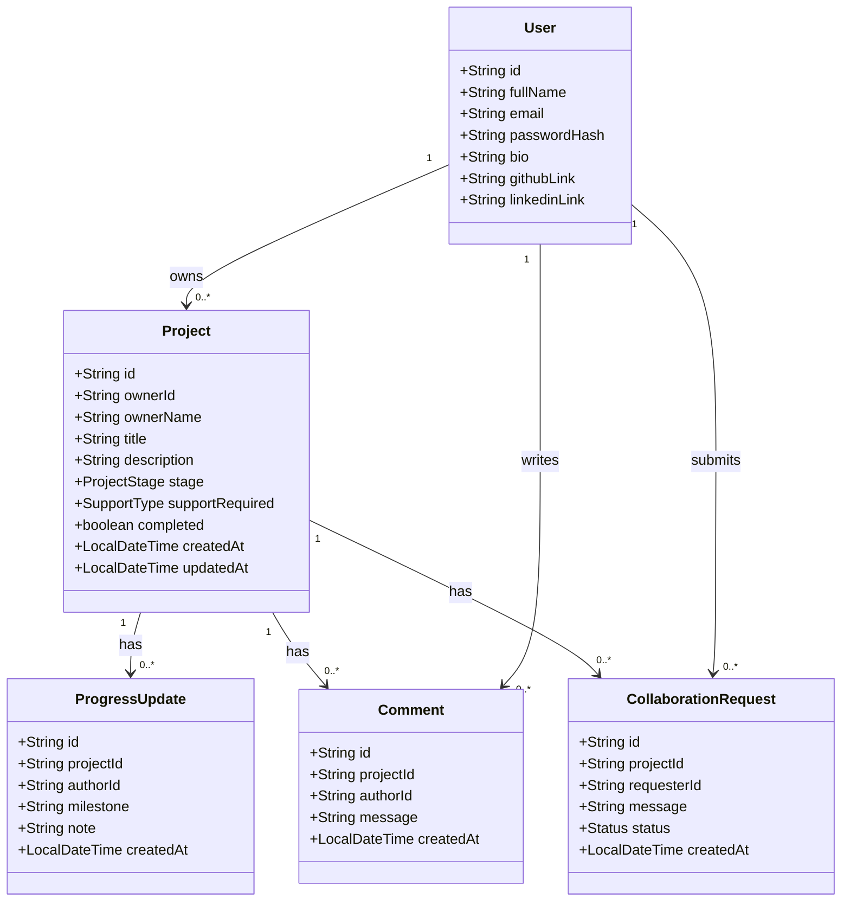

# UML - Class Diagram

```mermaid
classDiagram
    class User {
        +String id
        +String fullName
        +String email
        +String passwordHash
        +String bio
        +String githubLink
        +String linkedinLink
    }

    class Project {
        +String id
        +String ownerId
        +String ownerName
        +String title
        +String description
        +ProjectStage stage
        +SupportType supportRequired
        +boolean completed
        +LocalDateTime createdAt
        +LocalDateTime updatedAt
    }

    class ProgressUpdate {
        +String id
        +String projectId
        +String authorId
        +String milestone
        +String note
        +LocalDateTime createdAt
    }

    class Comment {
        +String id
        +String projectId
        +String authorId
        +String message
        +LocalDateTime createdAt
    }

    class CollaborationRequest {
        +String id
        +String projectId
        +String requesterId
        +String message
        +Status status
        +LocalDateTime createdAt
    }

    User "1" --> "0..*" Project : owns
    Project "1" --> "0..*" ProgressUpdate : has
    Project "1" --> "0..*" Comment : has
    Project "1" --> "0..*" CollaborationRequest : has
    User "1" --> "0..*" Comment : writes
    User "1" --> "0..*" CollaborationRequest : submits
```

This model matches the current backend entities and the expected challenge relationships.
