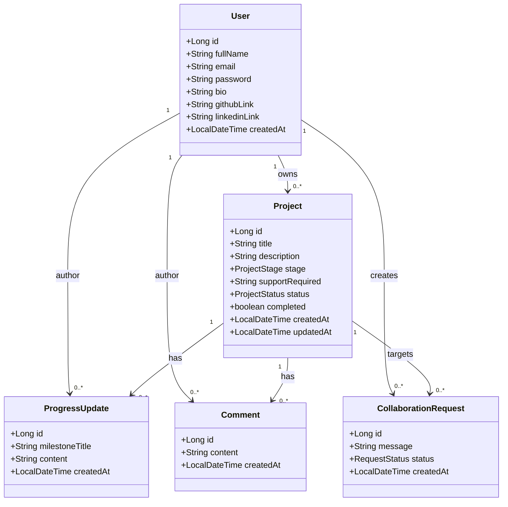

# MzansiBuilds UML Diagrams

Prepared for Derivco Code Skills Quest - Project Profiling

## Class Diagram - main domain model for the MVP

Class Diagram - entities, key attributes, and relationships used by the backend

## Backend architecture intent

Layered Spring Boot design with Controller -> Service -> Repository. JWT secures private actions, DTOs handle input/output, and ownership checks ensure only project owners can edit, update, or complete their own projects.
