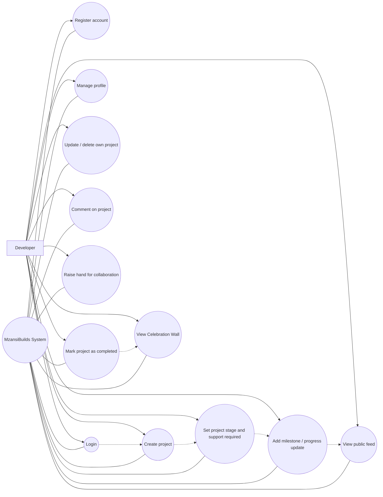

# MzansiBuilds UML Diagrams

Prepared for Derivco Code Skills Quest - Project Profiling

## Use Case Diagram - core developer journey and system interactions

System: MzansiBuilds

Dashed arrows indicate follow-on interactions within the MVP workflow.
