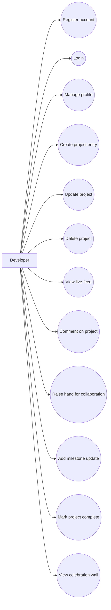

# UML - Use Case Diagram

```mermaid
flowchart LR
    A[Developer]

    UC1((Register account))
    UC2((Login))
    UC3((Manage profile))
    UC4((Create project entry))
    UC5((Update project))
    UC6((Delete project))
    UC7((View live feed))
    UC8((Comment on project))
    UC9((Raise hand for collaboration))
    UC10((Add milestone update))
    UC11((Mark project complete))
    UC12((View celebration wall))

    A --> UC1
    A --> UC2
    A --> UC3
    A --> UC4
    A --> UC5
    A --> UC6
    A --> UC7
    A --> UC8
    A --> UC9
    A --> UC10
    A --> UC11
    A --> UC12
```

This diagram captures the primary actor and user interactions specified in the Derivco challenge journey.
